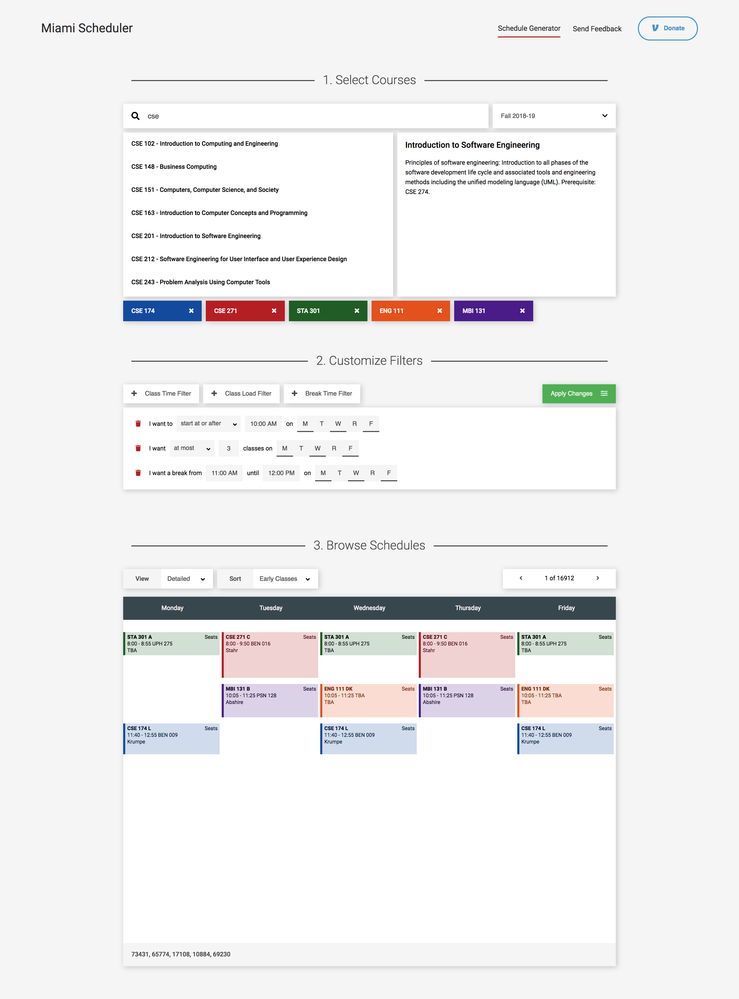

# miami-scheduler



## Install
```
git clone https://github.com/HilariousAtlantic/miami-scheduler
cd miami-scheduler
npm i
```

## Setup database
Create the Postgres database
```
createuser --createdb miami_scheduler
createdb -U miami_scheduler miami_scheduler
```
Create a `.env` file in the root with the following:
```bash
DATABASE_HOST=127.0.0.1
DATABASE_PORT=5432
DATABASE_NAME=miami_scheduler
DATABASE_USER=miami_scheduler
DATABASE_PASSWORD=
```
Create the database tables and import the data
```
npm run create
npm run import
```

## Run
```
npm run dev
```
